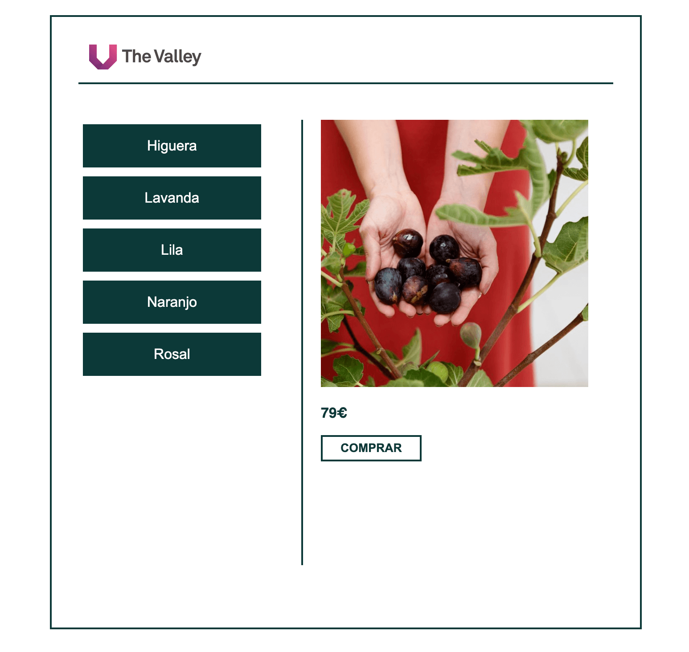

# Taller: Cómo aprender JavaScript

En este taller realizaremos el código JS de la siguiente página web:

[https://the-valley-school.github.io/taller-como-aprender-javascript/](https://the-valley-school.github.io/taller-como-aprender-javascript/)

Por si te da pereza navegar hasta el enlace 😜 te dejamos también una captura:

## Algunos recursos online gratis para aprender JavaScript por tu cuenta:

[https://www.freecodecamp.org/learn/javascript-algorithms-and-data-structures/basic-javascript](https://www.freecodecamp.org/learn/javascript-algorithms-and-data-structures/basic-javascript)
[https://developer.mozilla.org/en-US/docs/Web/JavaScript/Guide](https://developer.mozilla.org/en-US/docs/Web/JavaScript/Guide)

Recuerda que también puedes buscar cosas concretas en Google filtrando por site:stackoverflow.com

## Libros (aún existen):

[https://www.amazon.com/You-Dont-Know-Js-Going/dp/1491924462/ref=dp_rm_title_0](https://www.amazon.com/You-Dont-Know-Js-Going/dp/1491924462/ref=dp_rm_title_0)

## Nuestro Máster de Desarrollo Web:

Sin duda la mejor manera de aprender JavaScript

[https://thevalley.es/formacion/master-desarrollo-web/](https://thevalley.es/formacion/master-desarrollo-web/)